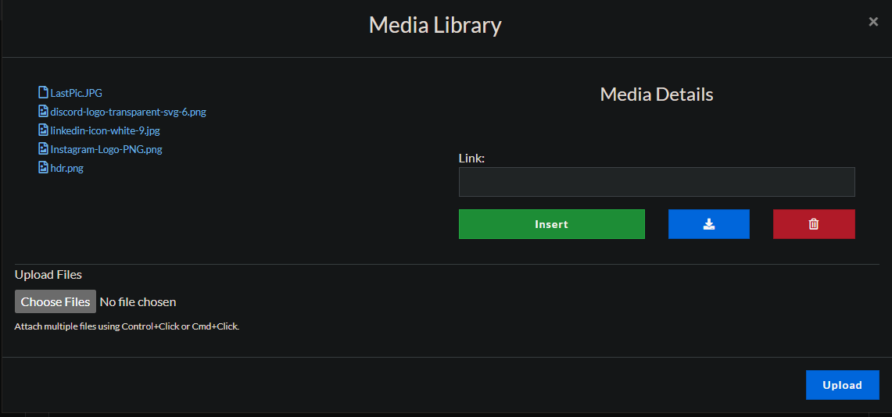

# The FASTCTF CTFd Landing Page
This is the landing page I created for the Forensics and General CTFs at SCaLE 21x. It can be used interchangably throughout other CTFd-based events in the future. All that needs to be done is downloading the images, upload them to the CTFD platform via the CTFd admin panel, select their paths, and then past them into the ``img src = ""`` section of the line you want to change.

## Uploading an image 
To upload an image, you must be in a page's content page and you mst then click the "Media Library" button. 

After doing so, a box will pop up that lists your media library. You will also have the opption to upload an image. You want to do that, so select that button and navigate to the image file you want on our computer and upload it. The upload is confirmed by clicking the upload button. Uploaded files are hyperlinked. Be sure to note the name of the image you uploaded if there are multiple uploads.

## Finding the path to an image
It is easy to find the location of the image on the server. Since the images are hyperlinked, just click the image you want in the media library and copy the image's location in the ``Link: `` box. You may have to scroll down if the image you chose is large and does not fit your screen
